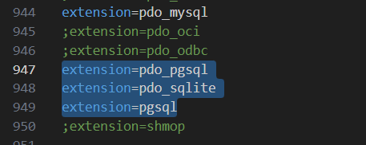

## Instruções de instalação

<ul>
<li>Para executar a aplicação é necessário instalar o composer disponível em: https://getcomposer.org/download/</li>
<li>É necessário também o postgreSQL disponível em : https://www.postgresql.org/download/</li>
<li>E o npm (node package managaer) </li>
<li>Após a instalação do composer digitar no terminal o seguinte comando: composer global require larave/installer</li>
</ul>

### Instruções de configuração
Configurar o php para que possa se conectar com o postgreSQL, dentro do arquivo php.ini remover a marcação de comentário dos seguintes comandos:

<ul>
<li>Após instalar o laravel e clonar o repositório, no diretório do projeto executar: composer install</li>
<li>Instalar os pacotes node: npm install</li>
<li>Copiar o arquivo '.env.example' renomeando a cópia para '.env' : cp .env.example .env </li>
<li>Configurar o .env preencha os campos 'DB_USERNAME' e 'DB_PASSWORD' com as credenciais do postgreSQL</li>
<li>Gerar uma key com o comando: php artisan key:generate</li>
<li>Criar um database com o nome GFCPA no postgre: create database  gfcpa</li>
<li>Executar o comando de migração: php artisan db:migrate</li>
<li>Povoar o banco com o comando : php artisan db:seed</li>
<li>Executar os seguintes comandos: npm run build e npm run dev</li>
<li>Executar a aplicação com o comando: php artisan serve </li>
</ul>

